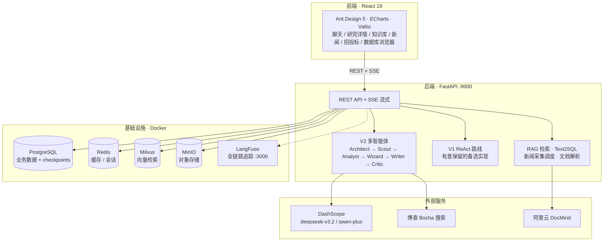

<div align="center">

# 🔍 行业信息助手

### Industry Information Assistant

基于**多智能体协作**的 AI 深度研究助手：从一个问题出发，自动规划大纲、并行检索、
数据分析、生成图表、撰写带引用的研究报告 —— 全程实时流式可见，支持断点续研。

[](LICENSE)
[](backend)
[](frontend)
[](backend)
[](docker-compose.yml)
[](https://github.com/EricKingWhy/deepresearch/commits/main)

</div>

---

## ✨ 核心特性

### 🤖 多智能体深度研究（V2，默认路线）

六智能体流水线协同完成一次深度研究，全程通过 SSE 实时推送每个智能体的进展：

| 智能体 | 职责 |
| ------ | ---- |
| **ChiefArchitect** | 理解问题，生成研究报告大纲 |
| **DeepScout** | 按大纲分节并行检索，收集事实 |
| **DataAnalyst** | 从事实中抽取结构化数据点 |
| **CodeWizard** | 生成 Python 代码绘制图表（matplotlib / seaborn → ECharts） |
| **LeadWriter** | 综合撰写最终研究报告 |
| **CriticMaster** | 对抗式评审：查缺失引用、逻辑漏洞、偏见与幻觉 |

- **🔄 双路线设计**：V2 多智能体（默认）/ V1 ReAct（有意保留的备选路线，PRD NG-2/NG-3）
- **⏸ 断点续研**：基于 Postgres 持久化的 checkpoint，研究中断后可恢复
- **🧠 模型分工**：各智能体可配置不同模型（如 Scout 用 `qwen-plus` 快而便宜，Writer 用 `deepseek-v3.2` 保质量），集中配置于 `backend/app/config/llm_config.py`

### 📚 RAG 知识库

- 文档上传解析（阿里云 DocMind）、Milvus 向量检索
- 引用溯源抽屉：报告中的每条引用可回看原文片段

### 📰 行业情报

- **新闻采集**：定时调度抓取行业新闻
- **招投标信息**：招标 / 中标数据查询
- **股票行情**：上市公司行情数据卡片
- 当前内置行业域：智慧交通、金融科技、医疗健康、能源（`industry_config.py` 可扩展）

### 🗄 自然语言查数

- **Text2SQL**：用自然语言查询业务数据库（含 UNION 注入防护）
- **数据库浏览器**：可视化探索表结构与数据

### 📊 数据可视化

- CodeWizard 自动生成统计图表；前端 ECharts 渲染
- 研究详情页**关系图谱**：前端基于研究结果渲染的可视化视图

### 🔭 可观测性（LangFuse）

自托管 LangFuse：LLM 全链路追踪、Token 成本分析、错误聚合。详见 [LangFuse 监控使用指南](docs/langfuse-monitoring.md)。

### 🔐 工程化

- JWT 鉴权（登录守卫 + 路由级权限）
- 后端/前端统一版本号，`CHANGELOG.md` 遵循 Keep a Changelog
- 质量硬化中：ruff 静态检查、pytest、批量代码审查门禁（见 `docs/hardening/`）

---

## 🏗 系统架构



---

## 🛠 技术栈

| 分层 | 技术选型 |
| ---- | -------- |
| 后端 | Python 3.10 · FastAPI · SQLAlchemy · LangGraph · LangChain · python-jose（JWT） |
| 前端 | React 19 · TypeScript · Vite · Ant Design 5 · ECharts · Valtio（状态管理） |
| 基础设施 | PostgreSQL 15 · Redis 7 · Milvus 2.3（向量库）· Elasticsearch 8（可选）· MinIO |
| 可观测 | LangFuse 自托管 · OpenTelemetry |
| LLM | 阿里云百炼 DashScope（`deepseek-v3.2` / `qwen-plus`）；亦支持 OpenRouter 多模型网关 |
| 搜索 | 博查 Bocha Search |

**关键外部 API 依赖**：

| API | 用途 | 是否必填 |
| --- | ---- | -------- |
| DashScope（阿里云百炼） | LLM & Embedding | ✅ 必填 |
| 博查搜索 | 联网检索 | ✅ 必填 |
| 阿里云 DocMind | 文档解析 | 可选 |
| 聚合数据 | 股票行情 | 可选 |
| 招投标 API | 招投标信息 | 可选 |
| OpenRouter | 多模型网关 | 可选 |

---

## 🚀 快速开始

### 前置条件

| 依赖 | 版本要求 | 说明 |
| ---- | -------- | ---- |
| Docker | 20.0+ | 运行 PostgreSQL / Redis / Milvus / Elasticsearch / MinIO |
| Python | 3.10+ | 后端服务 |
| Node.js | 18+ | 前端构建 |

### 1️⃣ 一键启动基础设施

```bash
# 方式 A：启动脚本（推荐）
chmod +x start-services.sh
./start-services.sh start

# 方式 B：Docker Compose
docker compose up -d

# 验证
./start-services.sh status   # 或 docker compose ps
```

| 服务 | 访问地址 |
| ---- | -------- |
| PostgreSQL | `localhost:5432`（用户 `postgres`，密码见 `.env` 中的 `POSTGRES_PASSWORD`） |
| Redis | `localhost:6379` |
| Milvus | `localhost:19530` |
| Elasticsearch | `localhost:1200` |
| MinIO Console | `localhost:9001`（账号/密码见 `.env` 中的 `MINIO_ROOT_USER` / `MINIO_ROOT_PASSWORD`） |

> ⚠️ 口令不再明文写在仓库里，统一从 `.env` 注入：根目录 `.env`（供 `docker compose`）与 `backend/.env`（供后端）。模板见 `.env.example` 与 `backend/.env.example`。

### 2️⃣ 配置环境变量

```bash
cd backend
cp .env.example .env   # 然后填入你的 API Key
```

**必填项**（其余已有合理默认值）：

```env
# 阿里云百炼 (LLM & Embedding)
DASHSCOPE_API_KEY=your-dashscope-api-key

# 博查搜索
BOCHA_API_KEY=your-bocha-api-key

# PostgreSQL（须与根目录 .env 中的 POSTGRES_PASSWORD 一致；留空后端启动失败）
# 生成方式: python -c "import secrets; print(secrets.token_urlsafe(24))"
POSTGRES_PASSWORD=

# MinIO（须与根目录 .env 一致）
MINIO_ROOT_USER=
MINIO_ROOT_PASSWORD=

# JWT 密钥（必填，长度 ≥ 32；留空/过短/沿用示例值后端启动时直接报错退出——
# 这是有意行为：公开可知的签名密钥可被用来伪造任意 Token）
# 生成方式: python -c "import secrets; print(secrets.token_urlsafe(48))"
JWT_SECRET_KEY=
```

### 3️⃣ 初始化数据库（手写迁移 SQL 为准）

后端启动**默认不执行** `create_all` 自动建表，建表以 `backend/migrations/` 的手写迁移 SQL 为准：

```bash
docker compose up -d postgres
docker compose exec -T postgres psql -U postgres -d industry_assistant < backend/migrations/20260719_research_observability.sql
docker compose exec -T postgres psql -U postgres -d industry_assistant < backend/migrations/20260719_unique_research_checkpoint_session_id.sql
```

> 本地开发想跳过迁移、由 ORM 直接建表：在 `backend/.env` 设置 `DB_AUTO_CREATE=1`。
> 注意两种方式不要混用同一张表——`create_all` 只创建缺失的表，不会补迁移里 `ALTER TABLE` 增加的列。

### 4️⃣ 启动后端

```bash
cd backend
conda create -n deepresearch python=3.10 && conda activate deepresearch  # 推荐虚拟环境
pip install -r requirements.txt
python app/app_main.py        # http://localhost:8000，API 文档见 /docs
```

### 5️⃣ 启动前端

```bash
cd frontend
npm install --legacy-peer-deps   # React 19 + Ant Design 需此 flag 解决依赖冲突
npm run dev                      # http://localhost:5173/login
```

### 常用服务管理命令

```bash
./start-services.sh start     # 启动全部
./start-services.sh status    # 查看状态
./start-services.sh logs postgres   # 查看某服务日志
./start-services.sh restart   # 重启
./start-services.sh stop      # 停止
./start-services.sh clean     # 清理数据（危险操作！）
```

### 上传测试文档（可选）

```bash
# 该接口要求认证：先从 /auth/login 取 Token，再带上 Authorization 头
curl -X POST "http://localhost:8000/documents/upload" \
  -H "Authorization: Bearer <你的Token>" \
  -H "Content-Type: multipart/form-data" \
  -F "file=@./test/test_doc.pdf"
```

---

## 📁 项目结构

```
deepresearch/
├── backend/
│   ├── app/
│   │   ├── app_main.py              # FastAPI 入口
│   │   ├── config/                  # llm_config（模型集中配置）/ 行业配置 / 股票映射
│   │   ├── core/                    # 数据库 / Redis / JWT 安全 / 序列化
│   │   ├── models/                  # SQLAlchemy ORM（user / chat / knowledge / research…）
│   │   ├── router/                  # auth / chat / search / research / news / knowledge…
│   │   ├── service/                 # 业务逻辑核心
│   │   │   ├── deep_research_v2/    # ⭐ 多智能体研究系统（graph / state / agents）
│   │   │   ├── retrieval_service.py # RAG 检索
│   │   │   ├── text2sql_service.py  # 自然语言查数
│   │   │   ├── chart_generator.py   # 数据可视化
│   │   │   └── …                   # stock / bidding / news / docmind / checkpoint…
│   │   └── scripts/                 # 数据初始化脚本
│   ├── migrations/                  # 手写建表/变更 SQL（建表唯一权威来源）
│   └── requirements.txt
├── frontend/
│   └── src/
│       ├── pages/                   # chat（流式研究）/ knowledge / news / bidding / database / auth
│       ├── components/              # chart / sender / markdown / chunks-drawer / stock-card…
│       ├── api/                     # axios 客户端（插件式：鉴权 / 错误提示 / 防重复）
│       ├── store/                   # Valtio 状态（auth / session / knowledge / industry…）
│       └── router/ · layout/
├── docker/                          # LangFuse 等自托管服务编排
├── observability/                   # 可观测性配置
├── docs/                            # 架构文档 / LangFuse 指南 / 质量硬化（hardening/）
├── docker-compose.yml               # 基础设施一键编排
├── start-services.sh                # 服务管理脚本
├── CHANGELOG.md                     # Keep a Changelog 格式的变更记录
├── CONTRIBUTING.md                  # 贡献指南
└── LICENSE                          # MIT
```

---

## 📖 文档

| 文档 | 说明 |
| ---- | ---- |
| [`docs/architecture.md`](docs/architecture.md) | 架构总览：双研究路线 / V2 流程 / RAG 数据流 / 基础设施矩阵 |
| [`docs/langfuse-monitoring.md`](docs/langfuse-monitoring.md) | LangFuse 监控部署与使用指南 |
| [`docs/hardening/`](docs/hardening/) | 质量硬化计划：PRD / 执行循环协议 / 进度追踪 / tickets |
| [`CHANGELOG.md`](CHANGELOG.md) | 版本变更记录（Keep a Changelog） |
| [`CONTRIBUTING.md`](CONTRIBUTING.md) | 如何参与贡献 |
| [`CLAUDE.md`](CLAUDE.md) / [`AGENTS.md`](AGENTS.md) | 给 AI 编码助手（Claude Code / Codex / Cursor…）的仓库工作指南 |

---

## ❓ 常见问题

<details>
<summary><b>Docker 容器启动失败？</b></summary>

```bash
./start-services.sh status          # 查看状态
./start-services.sh logs postgres   # 看具体服务日志
./start-services.sh restart         # 重启全部
```

</details>

<details>
<summary><b>后端连接数据库失败？</b></summary>

1. 先确认 Docker 服务已启动：`./start-services.sh status`
2. 检查 `.env`：`POSTGRES_PASSWORD` 为必填项，不要沿用任何示例值；须与根目录 `.env` 一致
3. 端口冲突（如本机装了 PostgreSQL）：停掉本地服务或修改 `docker-compose.yml` 端口映射

</details>

<details>
<summary><b>前端 npm install 报错？</b></summary>

```bash
npm install --legacy-peer-deps          # 解决 React 19 + Ant Design 依赖冲突
rm -rf node_modules package-lock.json && npm install --legacy-peer-deps   # 还不行就清缓存重试
```

</details>

<details>
<summary><b>研究历史无法恢复右侧面板数据？</b></summary>

执行数据库迁移后重启后端：

```sql
ALTER TABLE research_checkpoints ADD COLUMN IF NOT EXISTS ui_state_json JSONB;
ALTER TABLE research_checkpoints ADD COLUMN IF NOT EXISTS final_report TEXT;
```

</details>

---

## 🤝 参与贡献

详见 [`CONTRIBUTING.md`](CONTRIBUTING.md)。核心约定（同样写在 `AGENTS.md`）：

1. **不直接 push 到 `main`**：每张 ticket 独立分支 + PR
2. **不把真实密钥写入**任何被 git 跟踪的文件（PRD / ticket / issue / commit message / 日志一律包括）
3. 验收必须是**可执行命令 + 可判定输出**，不以"人工检查"充数

---

## 📄 开源协议

本项目基于 [MIT](LICENSE) 协议开源。
